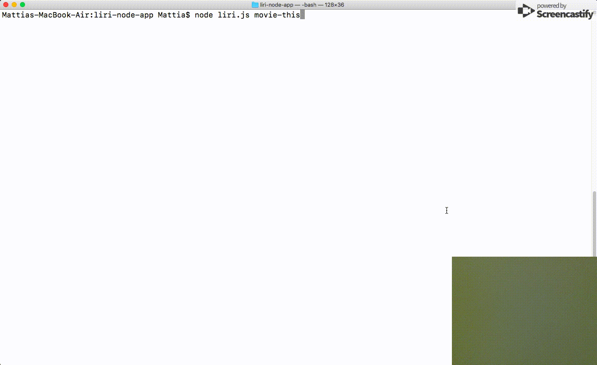

# LIRI
# A Node Application 
Search OMDB, Spotify, and Bands in Town APIs.
Built on NodeJS.

# What Does LIRI do?
SIRI = Speech Interpretation and Recognition Interface 
LIRI = Language Interpretation and Recognition Interface.
LIRI is a command line node app that takes in the following parameters: 

1. movie-this
Searches OMDB API for movie/show title.
node liri.js movie-this '<movie name here>'

2. concert-this
Searches Bands-in-Town API for Concerts
node liri.js concert-this <artist/band name here>

3. spotify-this-song
Search Spotify for song titles.
node liri.js spotify-this-song '<song name here>'

4. do-what-it-says
Runs command found in random.txt file. Default is searching Spotify for"
Backstreet Boys' hit song, "I want it that way"
node liri.js do-what-it-says

# Environment Setup
To use LIRI, you need to create a file named .env, add the following to it, replacing the values with your API keys (no quotes) once you have them: 

# Spotify API keys
SPOTIFY_ID=your-spotify-id
SPOTIFY_SECRET=your-spotify-secret

# APIs used in this bot:
Node-Spotify-API

Axios

OMDB API

Bands In Town API

Moment

DotEnv